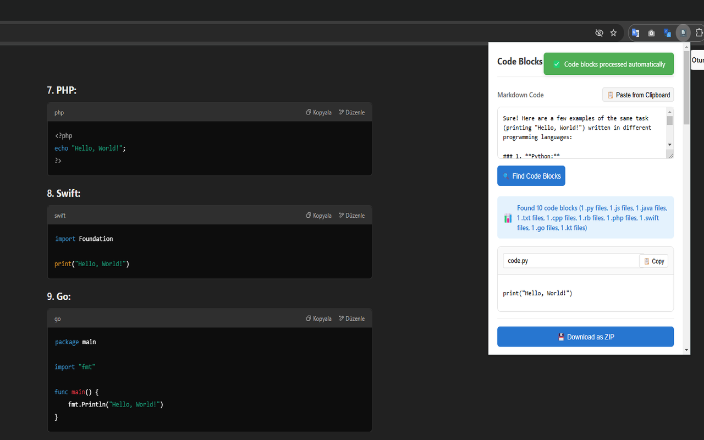

# MD Code Extractor - Chrome Extension

A Chrome extension that automatically extracts code blocks from markdown content and saves them as individual files.

[](https://chromewebstore.google.com/detail/ploffmjofgajdecipodekbnjloclenhh)



## Features

- 🔍 **Automatic Code Block Detection**: Automatically detects markdown code blocks when you copy text
- 🏷️ **Smart Language Detection**: Identifies programming languages based on code content and syntax
- 📝 **Intelligent File Naming**: Generates meaningful file names based on class/function names
- 💾 **Bulk Export**: Export all code blocks as a ZIP file with proper file extensions
- ⚙️ **Customizable Settings**: Configure language extensions and file naming patterns
- 📋 **Clipboard Integration**: Automatically processes code when you copy markdown content
- 🎨 **Modern UI**: Clean and intuitive user interface with smooth animations

## Installation

1. Clone this repository or download the ZIP file
2. Open Chrome and navigate to `chrome://extensions/`
3. Enable "Developer mode" in the top right corner
4. Click "Load unpacked" and select the extension directory

## Usage

1. Copy any markdown content containing code blocks
2. Click the extension icon in your Chrome toolbar
3. The extension will automatically detect and display code blocks
4. Edit file names if needed
5. Click "Download as ZIP" to save all code blocks

### Supported Languages

- JavaScript/TypeScript
- Python
- Java
- C#
- C++
- PHP
- HTML/CSS
- Ruby
- Go
- Rust
- Swift
- Kotlin
- And many more...

### Example

When you copy markdown content like this:

\```javascript
class HelloWorld {
    sayHello() {
        console.log("Hello, World!");
    }
}
\```

The extension will:
1. Detect the language (JavaScript)
2. Extract the class name for the filename
3. Create a file named `HelloWorld.js`

## Configuration

Click the "Options" button in the extension popup to:
- Add new languages
- Customize file extensions
- Configure filename patterns
- Group and organize languages

## Permissions

The extension requires the following permissions:
- **Clipboard Read**: To detect markdown code when copied
- **Downloads**: To save code blocks as files
- **Storage**: To save your language settings
- **Tabs**: To process markdown content from active tabs
- **Notifications**: To notify when code blocks are detected

## Development

### Prerequisites
- Chrome Browser
- Basic knowledge of Chrome Extension development

### Project Structure
```
├── manifest.json        # Extension configuration
├── popup.html          # Main UI
├── popup.js           # Core functionality
├── options.html       # Settings page
├── options.js        # Settings management
├── content.js        # Content script
├── background.js     # Background service
└── icons/           # Extension icons
```

### Building
1. Make your changes
2. Test the extension locally

## Contributing

1. Fork the repository
2. Create your feature branch (`git checkout -b feature/AmazingFeature`)
3. Commit your changes (`git commit -m 'Add some AmazingFeature'`)
4. Push to the branch (`git push origin feature/AmazingFeature`)
5. Open a Pull Request

## License

This project is licensed under the MIT License - see the [LICENSE](LICENSE) file for details.

## Acknowledgments

- Built with Chrome Extension APIs
- Uses JSZip for file compression
- Inspired by the need for better code block management 